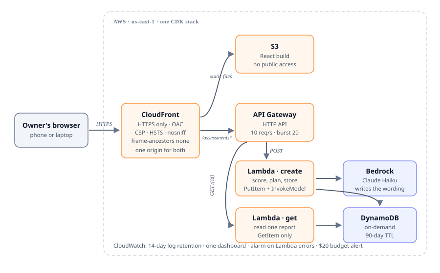

# Architecture

One CDK stack in `us-east-1`. Everything is serverless and on-demand; there is
nothing to keep running between assessments.

## The request path

**Loading the app.** The browser hits CloudFront, which serves the React build
from S3 through Origin Access Control. The bucket blocks all public access —
S3 has no publicly reachable URL at all.

**Taking the check.** The questionnaire is entirely client-side. The question
bank is baked into the bundle at build time, so moving between steps costs no
network round trips and the app works on a bad connection until the moment it
submits.

**Submitting.** `POST /assessments` goes to CloudFront, matches the
`assessments*` behaviour, and is forwarded to the HTTP API. The create Lambda
validates the body against the question bank, scores it in Python, asks
Bedrock for the plan wording, stores the result, and returns the whole report
in the response — so the report page renders immediately without a second
fetch.

**Sharing.** `GET /assessments/{id}` is a separate Lambda with a separate
role. Someone opening a shared link fetches the stored report.

## Why the API is on the same origin

CloudFront routes `assessments*` to API Gateway rather than the browser
calling `execute-api` directly. Three consequences:

1. The browser never makes a cross-origin request, so CORS is not in the
   critical path and cannot break the app through misconfiguration.
2. The Content-Security-Policy keeps `connect-src 'self'` instead of having to
   name an API domain.
3. The Lambda omits `Access-Control-Allow-Origin` entirely unless
   `ALLOWED_ORIGIN` is set. A deployment that is never configured **denies**
   cross-origin access rather than allowing it — the failure mode is closed.

The cost is that the API is reachable directly at its `execute-api` URL as
well. That endpoint is subject to the same validation, the same throttling,
and the same unguessable ids, and a browser on another origin still gets no
CORS header from it.

## Data model

One DynamoDB table, on-demand billing, no secondary indexes — a report is only
ever fetched by its own id.

| Attribute | Value |
|---|---|
| `pk` | `ASSESSMENT#<id>` |
| `sk` | `REPORT` |
| `expires_at` | epoch seconds, now + 90 days — the table's TTL attribute |
| `score`, `band`, `sections`, `plan`, `profile` | the report as returned |
| `answers` | kept so a score can be re-derived and checked |

DynamoDB may serve an item for up to about 48 hours after its TTL passes, so
`get_report()` re-checks `expires_at` and treats a late item as gone. The
deletion promise is kept by the code, not only by the table setting.

## Scoring

`backend/questions.json` is the single source of truth: 26 questions, six
sections, 42 distinct IG1 safeguards, and the remediation copy the fallback
plan is built from. No other file hardcodes a question id.

The score is a weighted percentage — `Yes 1.0 · Partly 0.5 · No 0 · Not sure
0` — computed in Python. Tests assert it is deterministic, independent of JSON
key order, and monotonic: improving any single answer can never lower the
total.

Gaps are ordered worst-first: an outright "no" before a "partly", then by the
bank's own priority. That ordering is what decides which eight actions make
the plan, and it is why multi-factor authentication comes out on top for a
business that has nothing in place.

## The plan, and the fallback

Bedrock receives only what `build_model_input()` assembles: the score, the
section breakdown, the failed and partial safeguards, the industry, and the
headcount. There is no field in that payload a user can type free text into,
which removes prompt injection as a concern rather than trying to filter for
it. Business name and email never appear.

Everything returned is validated before it reaches a browser. Missing fields
raise; unknown effort levels and out-of-range weeks are clamped; over-long
text is truncated; more than eight actions are dropped.

Any failure — a timeout, a throttle, malformed JSON, a plan of the wrong shape
— falls back to a plan built from the question bank's own remediation copy,
spread across four weeks by urgency. The response carries `plan.source` so the
difference is visible in logs, but the owner gets the same advice either way.

This is the main reason the app cannot show an error page during a demo.

## Security controls

| Control | Where |
|---|---|
| Least-privilege IAM | `infra/lib/baseline-stack.ts` — one action, one ARN, per function |
| Input validation | `backend/baseline/validation.py` — allowlist against the bank |
| Body size limit | 16 KB, checked before parsing |
| Unguessable ids | `secrets.token_urlsafe(16)` — 128 bits |
| Throttling | 10 req/s, burst 20, on the HTTP API stage |
| CSP, HSTS, nosniff, `frame-ancestors 'none'` | CloudFront response headers policy |
| Encryption at rest | DynamoDB AWS-managed keys; S3 SSE-S3 |
| TLS only | `enforceSSL` on the bucket; `redirect-to-https` on CloudFront |
| No public S3 | Block Public Access plus Origin Access Control |
| Data minimisation | No PII required; what is optional never reaches Bedrock |

Run `npx cdk synth` and read the template — every claim above is visible in
the generated CloudFormation.

## Observability and cost

CloudWatch log groups retain 14 days. One dashboard shows assessments started,
errors, p95 duration, and DynamoDB consumption. One alarm fires on any Lambda
error in a five-minute window and publishes to an SNS topic. An AWS Budgets
alert warns at 80% of $20 actual and 100% forecast.

Alarm and budget notifications need an address, which is deliberately not in
this repo. Pass `-c alertEmail=...` at deploy time; without it the stack
deploys fine and says in its outputs that those notifications are off.

## Deliberate trade-offs

**boto3 `invoke_model` rather than the Anthropic SDK.** The Lambda has no
third-party dependencies, so it needs no bundling step, no container build,
and no layer. For a project whose first requirement is "the live URL must
never be broken", removing Docker from the deploy path was worth more than a
nicer client.

**The question bank is baked into the bundle, not fetched.** It costs a few KB
and removes an endpoint, a round trip, and a failure mode. The build strips
the remediation copy first so the questionnaire does not ship its own answer
key.

**Reports are protected by an unguessable URL, not a login.** Asking a
non-technical owner to create an account to see a free readiness score would
lose most of them before the first question. The report page says plainly that
anyone with the link can read it.

**`RETAIN` on the DynamoDB table.** `cdk destroy` will not silently delete
other people's reports. The bucket is `DESTROY` because it holds only build
output.
